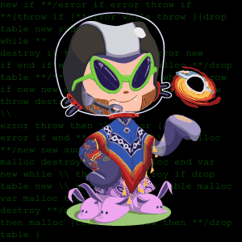

<h2 align="left">Hey,:wave: I'm Ajeya!</h2>

```diff
+ [aj-ya@github! ~] $echo "I'm a 20 y/o CSE-undergrad student with a passion for FOSS! " +
```


<pre ><code class="language-js">{
    code: ["C", "C++", "Python", "JavaScript", "React", "Tex"],
    frameworks: ["LaTex", "NodeJs", "React", "Redux", "Jupyter"],
    learning: [".jsx", ".sh", ".ts", "ReactNative", "D3JS", "k8s"],
    tools:["git", "k8s", "docker", "npm"],
    devEnv:
    {
        os:arch-linux,
        wm: bspwm,
        code:vs-code,
        dotfiles: umm!,
        tags:["sh4n1","aj-ya"],
    }
}</code></pre>
<br>
<p style="padding-top:15px"><b>Contact me @</b> &nbsp; <a style="display:inline" href="https://www.github.com/aj-ya">
    
  </a> &nbsp; <a href="https://twitter.com/bhat_ajeya">
    
  </a> &nbsp; <a href="https://steamcommunity.com/id/sh4n1/">
    
  </a> &nbsp; <a href="https://www.linkedin.com/in/aj-ya/">
    
  </a>
</p>
<!--
     -->
   
   
    

